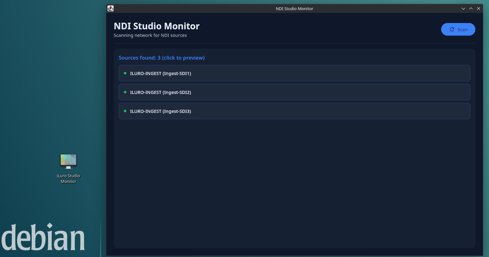
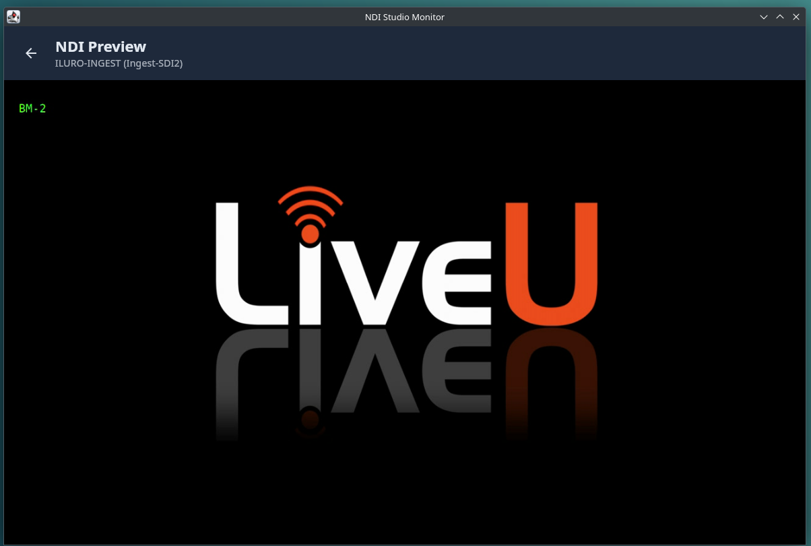

# 📺 NDI Monitor for Linux

<p align="center">
  
  
  
</p>

**Professional NDI Studio Monitor for Linux** - Discover, scan, and preview NDI® sources on your network in real-time with a modern, intuitive interface.

## ✨ Features

- 🔍 **Network Discovery** - Automatic detection of all NDI sources on your local network
- 📺 **Live Video Preview** - Single-click access to real-time video streams from any source
- 🎨 **Modern Dark UI** - Beautiful, professional interface built with Jetpack Compose Desktop
- ⚡ **High Performance** - Native Linux application with hardware-accelerated rendering
- 🖥️ **Desktop Integration** - Seamless installation into your system application menu
- 📦 **Self-Contained Runtime** - Bundled Java runtime, no Java installation required
- 🐧 **Linux Optimized** - Purpose-built for Linux x64 systems

> **⚠️ Note:** This application requires the NDI® Runtime to be installed separately. See [Installation](#installation) section for details.

## 📸 Screenshots

<p align="center">
  
  <br>
  <em>Network scanning interface - Discover all NDI sources on your network</em>
</p>

<p align="center">
  
  <br>
  <em>Real-time video preview with hardware acceleration</em>
</p>

## 📦 Installation

### System Requirements

- **Operating System**: Linux x64 (Ubuntu 20.04+, Fedora 35+, Debian 11+, or compatible)
- **Architecture**: x86_64 / AMD64
- **RAM**: 512 MB minimum, 1 GB recommended
- **Network**: Multicast-enabled network interface for NDI discovery
- **Disk Space**: 150 MB free space
- **NDI SDK**: Required (see [Prerequisites](#prerequisites) below)

### Prerequisites

**⚠️ REQUIRED:** This application requires the NDI® SDK to be installed on your system.

#### Installing NDI SDK for Linux

1. **Download NDI SDK:**
   - Visit: **https://ndi.video/for-developers/ndi-sdk/**
   - Click "Download NDI SDK" and select "Linux"
   - Accept the license agreement and download the installer

2. **Install NDI Runtime:**
   ```bash
   # Extract the downloaded archive
   tar -xzf InstallNDISDK_v6_Linux.tar.gz
   
   # Run the installer
   chmod +x InstallNDISDK_v6_Linux.sh
   sudo ./InstallNDISDK_v6_Linux.sh
   ```

3. **Copy NDI library to system path:**
   ```bash
   # Find where NDI SDK installed (usually ~/NDI SDK for Linux/)
   cd "~/NDI SDK for Linux/lib/x86_64-linux-gnu"
   
   # Copy to system library path
   sudo cp libndi.so.5 /usr/local/lib/
   sudo ln -sf /usr/local/lib/libndi.so.5 /usr/local/lib/libndi.so
   
   # Update library cache
   sudo ldconfig
   ```

4. **Verify installation:**
   ```bash
   # Check if library is found
   ldconfig -p | grep libndi
   # Should show: libndi.so -> /usr/local/lib/libndi.so.6
   ```

**Alternative:** You can also download **NDI Tools for Linux** from https://ndi.video/tools/ which includes the runtime.

### Quick Installation Guide

**Java is bundled** - no separate Java installation required!

1. **Download** the latest release archive from the [Releases](../../releases) page:
   ```
   ndi-monitor-linux-v1.0.0.tar.gz
   ```

2. **Extract** the archive:
   ```bash
   tar -xzf ndi-monitor-linux-v1.0.0.tar.gz
   cd ndi-monitor-linux
   ```

3. **Run the installer** with sudo privileges:
   ```bash
   sudo ./install.sh
   ```

4. **Launch** the application:
   - From terminal: `ndi-monitor-linux`
   - From application menu: Search for **NDI Monitor** (in Video category)

### Uninstallation

To remove NDI Monitor from your system:

```bash
sudo ./uninstall.sh
```

This will:
- Remove all application files from `/opt/ndi-monitor-linux/`
- Delete the desktop entry
- Remove the system command link

## 🚀 User Guide

### Getting Started

1. **Launch** the application from your application menu or by running `ndi-monitor-linux` in terminal

2. **Scan for sources**: Click the **"Scan Network"** button to discover all available NDI sources

3. **View live preview**: Click on any discovered source in the list to open a real-time video preview

4. **Navigate back**: Use the **"Back"** button to return to the source list

### Troubleshooting

**No sources found?**
- Ensure your network supports multicast (required for NDI discovery)
- Check that NDI sources are on the same network subnet
- Verify firewall settings allow mDNS/multicast traffic (UDP port 5353, 5960-5969)

**Application won't start / "Cannot find libndi.so" error?**
- **Verify NDI SDK is installed**: Run `ldconfig -p | grep libndi`
- **If not found**, follow the [Prerequisites](#prerequisites) section to install NDI SDK
- **Check library path**: Ensure `libndi.so` is in `/usr/local/lib/` or `/usr/lib/`
- **Run ldconfig**: `sudo ldconfig` to update library cache
- View detailed logs by running from terminal: `ndi-monitor-linux`

**Alternative: Set custom NDI library path:**
```bash
# If you installed NDI SDK in a custom location
export LD_LIBRARY_PATH="/path/to/ndi/lib:$LD_LIBRARY_PATH"
ndi-monitor-linux
```

## 🔧 Technical Information

### Architecture

- **Language**: Kotlin 2.0.21
- **UI Framework**: Jetpack Compose Desktop 1.7.3
- **Video Rendering**: Skia (hardware-accelerated)
- **NDI Integration**: Requires NDI® SDK 6.x (installed separately)
- **Runtime**: Bundled OpenJDK 17

### What's Included

The application package includes:
- Application binaries and Java runtime (bundled)
- Installation and uninstallation scripts
- Desktop integration files

**NDI® Runtime must be installed separately** - see [Prerequisites](#prerequisites) section.

### Installation Details

The installer performs the following actions:
- Copies application files to `/opt/ndi-monitor-linux/`
- Creates desktop entry in `/usr/share/applications/`
- Creates symbolic link in `/usr/local/bin/` for terminal access
- Sets appropriate permissions and ownership

**Note:** The installer does not install NDI SDK - this must be downloaded and installed separately from https://ndi.video/for-developers/ndi-sdk/ before running the application.

## 📋 Frequently Asked Questions

**Q: Do I need to install the NDI SDK separately?**  
A: Yes! You must download and install the NDI SDK for Linux from https://ndi.video/for-developers/ndi-sdk/. See the [Prerequisites](#prerequisites) section for detailed installation instructions.

**Q: Where do I get the NDI SDK?**  
A: Download from the official NDI developer portal: https://ndi.video/for-developers/ndi-sdk/ (requires free account registration)

**Q: Do I need to install Java?**  
A: No! The application includes its own Java runtime. Your system Java installation (if any) is not used.

**Q: What Linux distributions are supported?**  
A: Any modern Linux x64 distribution should work. Tested on Ubuntu 20.04+, Fedora 35+, and Debian 11+.

**Q: Can I run this on ARM/Raspberry Pi?**  
A: Not currently. This release is x64-only. ARM support may be added in future versions if NDI SDK provides ARM libraries.

**Q: The app says "Cannot find libndi.so" - what do I do?**  
A: Install the NDI SDK following the [Prerequisites](#prerequisites) section, then run `sudo ldconfig` to update the library cache.

## 🆘 Support & Contributing

- **Issues**: Report bugs or request features via [GitHub Issues](../../issues)
- **Questions**: Open a [Discussion](../../discussions) for usage questions
- **Security**: For security concerns, please contact us directly

## 📄 License

Copyright © 2026 iLuro. All rights reserved.

This software is proprietary. See [LICENSE](LICENSE) file for full terms and conditions.

---

**NDI® is a registered trademark of Vizrt NDI AB.**

This application uses NDI® technology and requires the NDI® Runtime to be installed separately. NDI® Runtime is provided by Vizrt and subject to their license terms.

This project is not affiliated with, endorsed by, or sponsored by Vizrt NDI AB.

---

<p align="center">
  <strong>NDI Monitor for Linux v1.0.0</strong><br>
  Made with ❤️ by <a href="https://broadcast-software-e.vercel.app/?utm_source=ig&utm_medium=social&utm_content=link_in_bio&fbclid=PAb21jcAPGQW5leHRuA2FlbQIxMQBzcnRjBmFwcF9pZA81NjcwNjczNDMzNTI0MjcAAadWACdbXQph5L8lCh_Em6nIc0evTZ8UlH7lbg5BS8hmnVSTenr7X593FQqqrQ_aem_b1nnT3h6t5_4FDMmm4Ue1w">iLuro</a>
</p>
